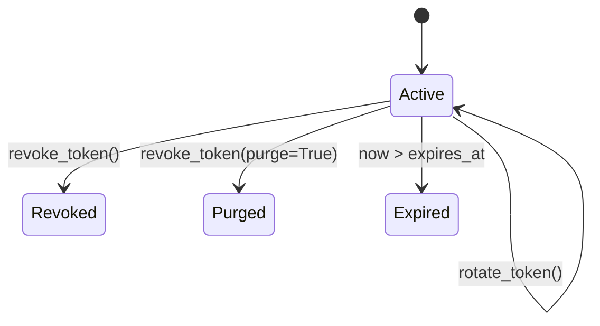

# Token Management

This guide covers creation, rotation, revocation, and operational handling. Use it as the lifecycle playbook for machine credentials managed by your Django app.

## Create Tokens

Create tokens through the service API so hashing, prefix generation, and scope validation are applied consistently.

```python
from datetime import timedelta
from django.utils import timezone
from keysmith.services.tokens import create_token

token, raw_token = create_token(
    name="billing-service",
    description="Used by billing worker",
    user=service_user,
    expires_at=timezone.now() + timedelta(days=90),
)
```

`create_token()` returns `(token, raw_token)`.
Only the hashed secret is stored (`token.key`).

## Rotate Tokens

Rotation is the safe default when a credential might be exposed but you still want to preserve token identity and metadata.

```python
from keysmith.services.tokens import rotate_token

new_raw_token = rotate_token(token, actor=request.user, request=request)
```

Rotation updates the stored hash and immediately invalidates the old raw token.

## Revoke or Purge Tokens

Revoke tokens when they should stop authenticating. Purge adds an explicit lifecycle marker for workflows that distinguish permanent retirement.

```python
from keysmith.services.tokens import revoke_token

revoke_token(token, actor=request.user, request=request)
revoke_token(token, purge=True, actor=request.user, request=request)
```

- `revoke=True` behavior: token cannot authenticate.
- `purge=True`: additionally marks the token as purged for lifecycle tracking.

## Useful Queries

These query patterns are useful for maintenance jobs and admin dashboards.

```python
from django.utils import timezone
from keysmith.models import Token

active_tokens = Token.objects.filter(revoked=False, purged=False)
expired_tokens = Token.objects.filter(expires_at__lt=timezone.now(), revoked=False)
user_tokens = Token.objects.filter(user=request.user).order_by("-created_at")
```

## Lifecycle Summary

The lifecycle states below are the operational states you should design around in internal tooling and incident response runbooks.



## Operations Checklist

Use this as a quick baseline policy when rolling Keysmith into production.

- Use one token per integration/service.
- Keep expiries finite.
- Rotate on credential exposure, not only on schedule.
- Pass `request` and `actor` to lifecycle services for richer audit context.
