# Django Keysmith

Django Keysmith is a token management layer for Django projects that need stronger lifecycle controls than static API keys. It keeps the authentication path straightforward while adding the operational pieces teams usually build themselves over time.

## What Keysmith Adds

Keysmith is designed for production usage where tokens are treated like credentials, not constants in settings files. The package focuses on protecting secrets at rest, giving clear lifecycle actions, and keeping integrations readable for app teams.

- Hashed token storage (`pbkdf2_sha512` by default)
- Lifecycle operations: create, rotate, revoke, optional purge
- Optional expiry windows
- Request and lifecycle audit logs
- Shared authentication core for plain Django and DRF
- Scope checks based on Django permission codenames

## How Authentication Works

The same validator powers both middleware and DRF authentication, so behavior is consistent no matter which integration style your project uses.

```mermaid
flowchart LR
    A[Client sends token] --> B[Middleware or DRF auth class]
    B --> C[Parse and checksum validation]
    C --> D[Indexed lookup by prefix]
    D --> E[Revoked/Purged/Expiry checks]
    E --> F[Hash verify]
    F --> G[Attach token context]
    G --> H[Permission checks]
    H --> I[View returns response]
    I --> J[Audit event recorded]
```



## Token Shape

Keysmith public tokens have enough structure to support fast validation and lookup while keeping only hashed secrets in storage.

```text
<namespace>_<identifier>:<secret><crc>
```

Example:

```text
tok_ab12CD34:superSecretValue...123456
```

- `namespace_identifier` is stored as `Token.prefix`.
- `secret` is never stored in plaintext.
- `crc` is a 6-digit checksum used for fast integrity checks.

## Start Here

If you are setting up Keysmith in a new project, begin with installation and quickstart before tuning settings.

- [Installation](installation.md)
- [Quick Start](quickstart.md)
- [Configuration](configuration.md)

## Integration Guides

Choose the integration style that matches your request stack. You can also combine both in one project.

- [Django REST Framework](integration/drf.md)
- [Plain Django](integration/plain-django.md)

## Core Guides

These guides cover day-2 operations such as rotation, permissions, and audit use.

- [Token Management](guide/token-management.md)
- [Authentication](guide/authentication.md)
- [Permissions and Scopes](guide/permissions.md)
- [Audit Logging](guide/audit-logging.md)

## API Reference

Use the API reference pages when you need exact function/class behavior while implementing features.

- [Services](api/services.md)
- [Models](api/models.md)
- [Authentication](api/authentication.md)
- [Permissions](api/permissions.md)
