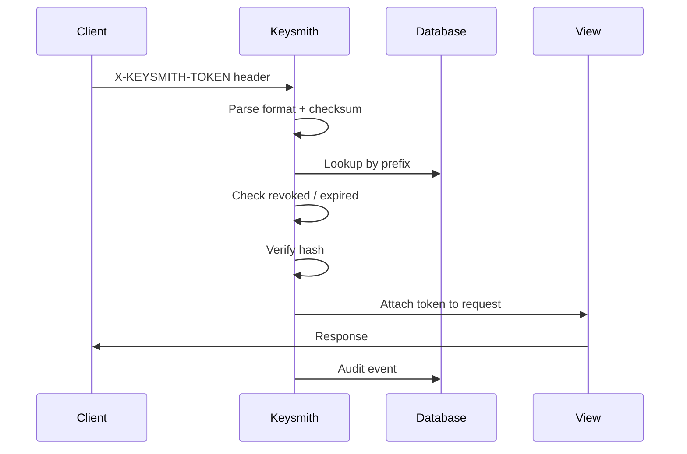

# Django Keysmith

<p class="ks-lead" markdown>

**Hashed API tokens for Django** - create, rotate, revoke, and audit machine credentials without
rolling your own key infrastructure.

</p>

```bash
pip install django-keysmith
```

<div class="ks-features" markdown>

<div class="ks-feature" markdown>

**Hashed secrets** PBKDF2-SHA512 at rest. Raw tokens shown once at creation.

</div>

<div class="ks-feature" markdown>

**Lifecycle API** `create_token`, `rotate_token`, `revoke_token`, `purge_token`.

</div>

<div class="ks-feature" markdown>

**Two integrations** Middleware + decorators for Django views. Auth classes for DRF.

</div>

<div class="ks-feature" markdown>

**Scopes** Permission codenames on each token - same primitives as Django auth.

</div>

</div>

---

## The problem Keysmith solves

Static API keys in environment variables work until they don't. Rotation means redeploying.
Revocation means grep-and-replace. Audit trails mean building logging yourself.

Keysmith treats tokens as first-class database records with explicit lifecycle operations, hashed
storage, and request-level audit events - so your team spends time on product code, not credential
plumbing.

---

## How a request is authenticated


```mermaid
sequenceDiagram
    participant Client
    participant Keysmith
    participant Database
    participant View

    Client->>Keysmith: X-KEYSMITH-TOKEN header
    Keysmith->>Keysmith: Parse format + checksum
    Keysmith->>Database: Lookup by prefix
    Keysmith->>Keysmith: Check revoked / expired
    Keysmith->>Keysmith: Verify hash
    Keysmith->>View: Attach token to request
    View->>Client: Response
    Keysmith->>Database: Audit event
```

One validator (`authenticate_token`) powers both the Django middleware and the DRF authentication
class. Behavior is identical regardless of how the request enters your app.

---

## Token format

```text
tok_a1B2c3D4:abcdefghijklmnopqrstuvwxyz012345678901234567890123456789012
└── prefix ──┘ └──────────── secret (32 chars default) ────────────────┘└ crc ┘
```

| Part             | Stored in DB? | Purpose                               |
| ---------------- | ------------- | ------------------------------------- |
| Prefix (`tok_…`) | Yes, indexed  | Fast lookup                           |
| Secret           | Hash only     | Verified on each request              |
| CRC (6 digits)   | No            | Reject malformed tokens before DB hit |

---

## Where to start

| I want to…                          | Go to                                        |
| ----------------------------------- | -------------------------------------------- |
| Install and run migrations          | [Install](getting-started/install.md)        |
| Create a token and call an endpoint | [Tutorial](getting-started/tutorial.md)      |
| Rotate or revoke credentials        | [Tokens](topics/tokens.md)                   |
| Protect Django views                | [Django integration](integrations/django.md) |
| Protect DRF endpoints               | [DRF integration](integrations/drf.md)       |
| Tune expiry, headers, scopes        | [Settings](topics/settings.md)               |
| Look up a function signature        | [Reference](reference/services.md)           |

---

## Requirements

- Python 3.9+
- Django 4.2+
- Django REST Framework 3.15.2+ _(optional, for DRF integration)_

```bash
pip install django-keysmith          # Django only
pip install "django-keysmith[drf]"     # with DRF support
```
