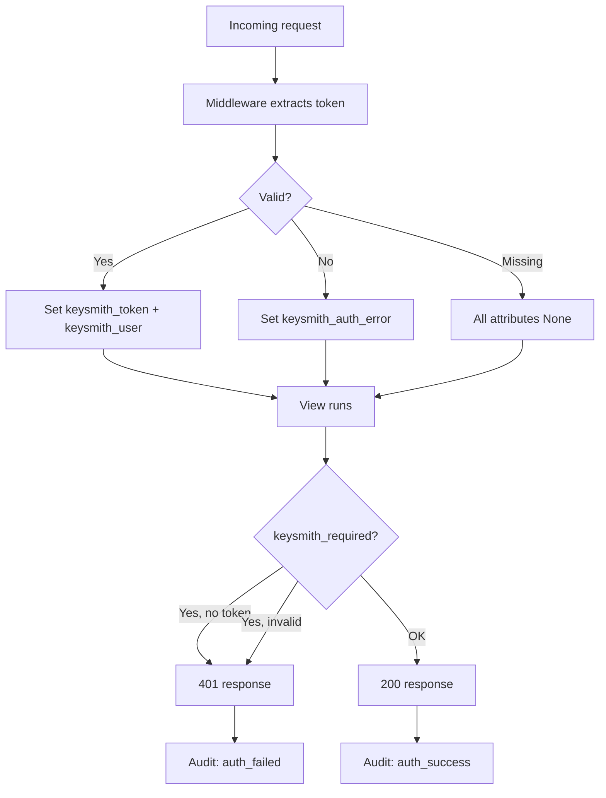

# Django integration

Use middleware and decorators when your API is built with standard Django views - function-based or class-based - without DRF.

---

## Setup

From [Install](../getting-started/install.md):

```python
INSTALLED_APPS = ["keysmith"]

MIDDLEWARE = [
    "django.contrib.auth.middleware.AuthenticationMiddleware",
    "keysmith.django.middleware.KeysmithAuthenticationMiddleware",
]
```

---

## How it works



Middleware never blocks requests. Enforcement is opt-in per view.

---

## Protecting views

```python
from django.http import JsonResponse
from keysmith.django.decorator import keysmith_required


@keysmith_required
def api_status(request):
    return JsonResponse({
        "prefix": request.keysmith_token.prefix,
        "user": getattr(request.keysmith_user, "username", None),
    })
```

### Decorator options

```python
@keysmith_required(
    allow_anonymous=False,    # reject requests with no token
    missing_message=None,     # custom 401 when token absent
    invalid_message=None,     # custom 401 when token invalid
)
def my_view(request):
    ...
```

| Mode | Behavior |
| --- | --- |
| Default | 401 if no token or invalid token |
| `allow_anonymous=True` | Allow missing token; still reject invalid tokens |

---

## Scope enforcement

```python
from keysmith.django.permissions import keysmith_scopes


@keysmith_required
@keysmith_scopes("write")
def create_resource(request):
    ...
```

Decorator order matters: `@keysmith_required` must be the outer decorator (listed first / applied last).

---

## Client usage

```bash
curl -H "X-KEYSMITH-TOKEN: <raw-token>" http://localhost:8000/api/status/
```

Customize the header via `KEYSMITH["HEADER_NAME"]`.

---

## Class-based views

Apply the decorator to `dispatch`:

```python
from django.views import View
from keysmith.django.decorator import keysmith_required


@keysmith_required
class SecureView(View):
    def get(self, request):
        return JsonResponse({"ok": True})
```

Or use `method_decorator` for individual HTTP methods.

---

## Testing

Simulate middleware in tests with `RequestFactory`:

```python
from django.test import RequestFactory
from keysmith.django.middleware import KeysmithAuthenticationMiddleware

factory = RequestFactory()
request = factory.get("/api/status/", HTTP_X_KEYSMITH_TOKEN=raw_token)

middleware = KeysmithAuthenticationMiddleware(lambda r: None)
middleware(request)

assert request.keysmith_token is not None
```

---

**See also:** [Authentication](../topics/authentication.md) · [Scopes](../topics/scopes.md) · [Authentication reference](../reference/authentication.md)
