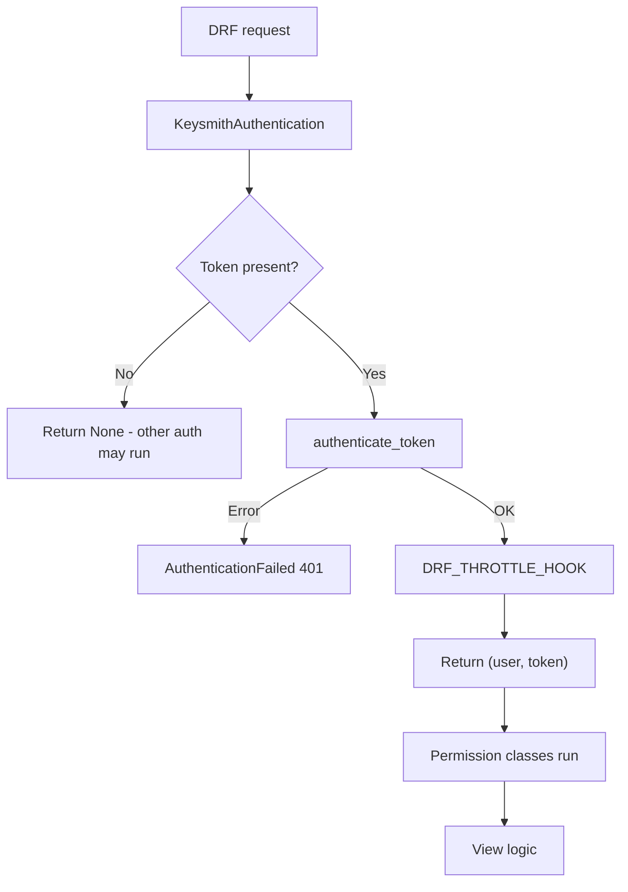

# Django REST Framework integration

Keysmith integrates with DRF's authentication and permission system. Install the optional extra and configure two classes.

---

## Setup

```bash
pip install "django-keysmith[drf]"
```

```python
REST_FRAMEWORK = {
    "DEFAULT_AUTHENTICATION_CLASSES": [
        "keysmith.drf.auth.KeysmithAuthentication",
    ],
    "DEFAULT_PERMISSION_CLASSES": [
        "keysmith.drf.permissions.RequireKeysmithToken",
    ],
}
```

Per-view overrides work as usual - global defaults just reduce boilerplate.

---

## How it works



After authentication:

- `request.auth` → `Token` instance
- `request.user` → `token.user` or DRF's unauthenticated user

---

## Basic endpoint

```python
from rest_framework.response import Response
from rest_framework.views import APIView


class StatusView(APIView):
    def get(self, request):
        return Response({
            "prefix": request.auth.prefix,
            "user_id": getattr(request.user, "pk", None),
        })
```

---

## Requiring authentication explicitly

```python
from keysmith.drf.permissions import RequireKeysmithToken


class StatusView(APIView):
    permission_classes = [RequireKeysmithToken]
```

`RequireKeysmithToken` raises `NotAuthenticated` when `request.auth` is missing.

---

## Scope-protected endpoints

```python
from keysmith.drf.permissions import RequireKeysmithToken, ScopedPermission


class WriteView(APIView):
    permission_classes = [RequireKeysmithToken, ScopedPermission("write")]

    def post(self, request):
        return Response({"created": True})
```

See [Scopes](../topics/scopes.md) for `HasKeysmithScopes` and view-level `required_scopes`.

---

## Throttling

Keysmith provides built-in rate throttling per token prefix using Django's cache framework:

```python
from keysmith.drf.throttling import KeysmithTokenRateThrottle
from rest_framework.views import APIView


class ResourceView(APIView):
    throttle_classes = [KeysmithTokenRateThrottle]
```

Configure rates globally in `settings.py`:

```python
REST_FRAMEWORK = {
    "DEFAULT_THROTTLE_CLASSES": [
        "keysmith.drf.throttling.KeysmithTokenRateThrottle",
    ],
    "DEFAULT_THROTTLE_RATES": {
        "keysmith_token": "1000/hour",
    },
}
```

### Custom Throttle Hook

For custom throttling logic, use `DRF_THROTTLE_HOOK`:

```python
from rest_framework.exceptions import Throttled

KEYSMITH = {
    "DRF_THROTTLE_HOOK": "myapp.hooks.throttle",
}


def throttle(request, token=None):
    if should_throttle(token):
        raise Throttled(detail="Too many requests")
```

Runs after successful authentication, before the view.

---

## Client usage

```bash
# Standard Authorization Bearer header (recommended)
curl -H "Authorization: Bearer <raw-token>" http://localhost:8000/api/status/

# Or custom X-KEYSMITH-TOKEN header
curl -H "X-KEYSMITH-TOKEN: <raw-token>" http://localhost:8000/api/status/
```

---

## Testing

```python
client.credentials(HTTP_AUTHORIZATION=f"Bearer {raw_token}")
response = client.get("/api/status/")
assert response.status_code == 200
```

---

## Middleware coexistence

Keysmith middleware and DRF auth can run together. DRF sets `_keysmith_skip_middleware_audit` on the underlying Django request to prevent duplicate audit events.

---

**See also:** [Authentication](../topics/authentication.md) · [Permissions reference](../reference/permissions.md)
