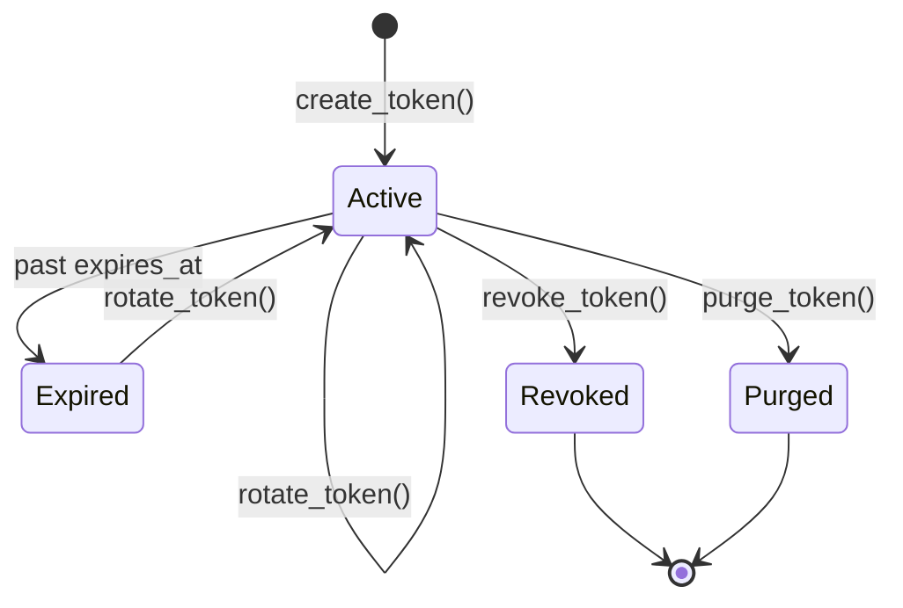

# Tokens & Lifecycle Management

In Keysmith, an API token is a first-class database entity representing a machine credential.

---

## Token Anatomy

Every Keysmith token contains three distinct components engineered for speed, security, and human readability:

<div class="ks-token-anatomy">

<div class="ks-token-pill">
  <span class="ks-token-part ks-token-part--prefix" title="Prefix (12 chars)">tok_a1B2c3D4</span>
  <span class="ks-token-part ks-token-part--sep">:</span>
  <span class="ks-token-part ks-token-part--secret" title="Secret (32 chars)">9aK2mX7pQ1rT4vW8yZ0bC3dF6hJ5nL8s</span>
  <span class="ks-token-part ks-token-part--crc" title="CRC32 Checksum (6 digits)">481029</span>
</div>

<div class="ks-token-legend">

<div class="ks-token-legend-card">
<strong><span class="ks-token-dot ks-token-dot--prefix"></span> Prefix (12 chars)</strong>
<p><code>tok_a1B2c3D4</code> &mdash; Indexed database column. Enables instant <code>O(1)</code> lookup without full-table scanning or decrypting.</p>
</div>

<div class="ks-token-legend-card">
<strong><span class="ks-token-dot ks-token-dot--secret"></span> Secret (32 chars)</strong>
<p><code>9aK2mX...nL8s</code> &mdash; High-entropy credential. Hashed at rest using PBKDF2 or SHA-256; never stored in plaintext.</p>
</div>

<div class="ks-token-legend-card">
<strong><span class="ks-token-dot ks-token-dot--crc"></span> Checksum (6 digits)</strong>
<p><code>481029</code> &mdash; CRC32 checksum. Validated in memory in microseconds to reject forged tokens before touching the database.</p>
</div>

</div>

</div>

1. **Prefix (`tok_a1B2c3D4`)**: A unique identifier prefixed with `tok_` (configurable via `TOKEN_PREFIX`). Stored in an indexed column for constant-time lookup.
2. **Secret (32 characters)**: A high-entropy cryptographic string. **Only a one-way cryptographic hash is saved in the database.**
3. **Checksum (6 digits)**: A CRC32 checksum computed over the prefix and secret. Validated in memory to instantly reject malformed tokens before running database queries.

---

## Token Types

Keysmith supports two distinct categories of tokens:

| Type | Intended Use | User Association | Example |
| :--- | :--- | :---: | :--- |
| **User Token** *(default)* | Client credentials acting on behalf of a specific human or service account. | Linked to `django.contrib.auth` User (`token.user`) | Developer personal access tokens, partner bot accounts. |
| **System Token** | Server-to-server or internal microservice communication where no single user exists. | `token.user = None` | Webhook ingestion, background cron workers, metrics scraping. |

To create a system token:

=== "Python"

    ```python
    from keysmith.services.tokens import create_token

    token, raw = create_token(
        name="Ingestion Worker",
        token_type="system",
    )
    ```

=== "CLI"

    ```bash
    python manage.py create_token --name "Ingestion Worker" --system
    ```

---

## The Token Lifecycle

Every token moves through a clear set of lifecycle states:



### 1. Active
The token exists, is not revoked or purged, and its expiration date is in the future. Requests pass authentication.

### 2. Rotated
When a token is rotated:
- Its **prefix and metadata remain unchanged** (name, user, scopes, description).
- A **new secret is generated and hashed**.
- The previous secret is immediately rendered invalid.
- If the token was previously expired, rotation automatically calculates a fresh expiration window!

```python
from keysmith.services.tokens import rotate_token

# Returns the new raw token string:
new_raw_token = rotate_token(token, actor=request.user, request=request)
```

### 3. Revoked
The token is deactivated by setting `revoked = True`. Any future authentication attempt is rejected with `401 Unauthorized`. Revocation is soft: the token record and its historical audit log remain intact for reporting and forensic analysis.

```python
from keysmith.services.tokens import revoke_token

revoke_token(token, actor=request.user, request=request)
```

### 4. Purged
Permanent soft-deletion. Sets both `purged = True` and `revoked = True`. Purged tokens are excluded from active administrative lists and cannot be un-revoked or rotated.

```python
from keysmith.services.tokens import purge_token

purge_token(token, actor=request.user, request=request)
```

### 5. Expired
When `timezone.now() > token.expires_at`, Keysmith blocks authentication with `ExpiredToken (401)`. You can rotate an expired token to re-enable it with a new secret and extended expiration date.

---

## Querying Tokens

The `Token` model provides convenient queryset methods:

```python
from django.utils import timezone
from keysmith.models import Token

# All active tokens capable of authenticating right now:
active_tokens = Token.objects.filter(
    revoked=False,
    purged=False,
    expires_at__gt=timezone.now(),
)

# All tokens issued to a specific user:
user_tokens = Token.objects.filter(user=user, revoked=False)

# Check token properties:
if token.is_active:
    print("Token is valid and active")

if token.is_expired:
    print("Token has expired")
```

---

## Best Practices

!!! tip "Graceful Key Rotation in Production"
    When rotating keys for high-traffic microservices, consider issuing a second temporary token with overlapping validity. Once the client has deployed the new key, revoke the old one.

!!! warning "Never Log Raw Secrets"
    Ensure your application logging masks raw token values. Keysmith automatically masks raw tokens in audit entries, storing only prefixes (`tok_...`).
