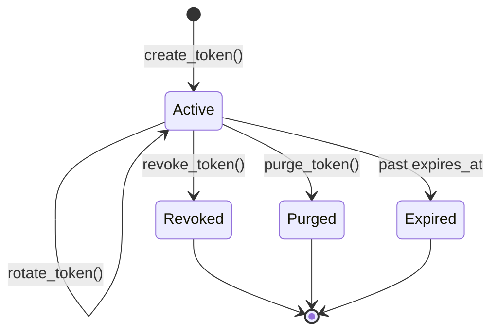

# Tokens

A Keysmith token is a database record representing a machine credential. The raw secret lives only in the client's hands - Keysmith stores a hash.

---

## Creating tokens

Always use `create_token()`. It handles prefix generation, hashing, scope validation, and audit logging.

```python
from datetime import timedelta
from django.utils import timezone
from keysmith.services.tokens import create_token

token, raw_token = create_token(
    name="billing-worker",
    description="Nightly billing job",
    user=service_user,
    created_by=admin_user,
    expires_at=timezone.now() + timedelta(days=90),
    request=request,  # optional - enriches audit context
)
```

| Argument | Required | Notes |
| --- |:---:| --- |
| `name` | ✓ | Max 128 characters |
| `description` | | Free text |
| `user` | | Linked user for request identity |
| `created_by` | | Who issued the token |
| `scopes` | | `Permission` instances; uses `DEFAULT_SCOPES` when omitted |
| `expires_at` | | Defaults to now + `DEFAULT_EXPIRY_DAYS` |
| `token_type` | | `"user"` (default) or `"system"` |
| `request` | | Adds path/IP/user-agent to audit event |

Returns `(token, raw_token)`. Store `raw_token` immediately.

---

## Lifecycle operations



### Rotate

Replaces the secret. Same prefix, scopes, and metadata. Old raw token invalidated immediately.

```python
from keysmith.services.tokens import rotate_token

new_raw = rotate_token(token, actor=request.user, request=request)
```

Raises `ValueError` if the token is revoked or purged.

### Revoke

Marks `revoked=True`. Token cannot authenticate.

```python
from keysmith.services.tokens import revoke_token

revoke_token(token, actor=request.user, request=request)
```

Idempotent - calling twice is safe. The `purge=True` keyword delegates to `purge_token()` for backward compatibility.

### Purge

Soft-delete: sets both `purged=True` and `revoked=True`.

```python
from keysmith.services.tokens import purge_token

purge_token(token, actor=request.user, request=request)
```

Use purge when workflows need to distinguish permanent retirement from a simple disable.

---

## Querying tokens

```python
from django.utils import timezone
from keysmith.models import Token

Token.objects.filter(revoked=False, purged=False)                          # active
Token.objects.filter(expires_at__lt=timezone.now(), revoked=False)         # expired
Token.objects.filter(user=service_user).order_by("-created_at")            # by owner
```

**Model helpers:**

| Property / method | Meaning |
| --- | --- |
| `token.is_expired` | `expires_at` is in the past |
| `token.is_active` | Not revoked, not purged, not expired |
| `token.can_authenticate()` | Same as `is_active` - required on custom models |
| `token.mark_used()` | Updates `last_used_at` (called automatically on auth) |

---

## Best practices

!!! tip "One token per integration"
    Issue separate tokens for each service or client. Limits blast radius and simplifies rotation.

!!! tip "Pass request context"
    Include `request` and `actor` in lifecycle calls so audit logs capture who did what and from where.

!!! tip "Rotate on exposure"
    Don't wait for a scheduled rotation window if a secret may have leaked.

---

**See also:** [Admin](admin.md) · [Services reference](../reference/services.md)
